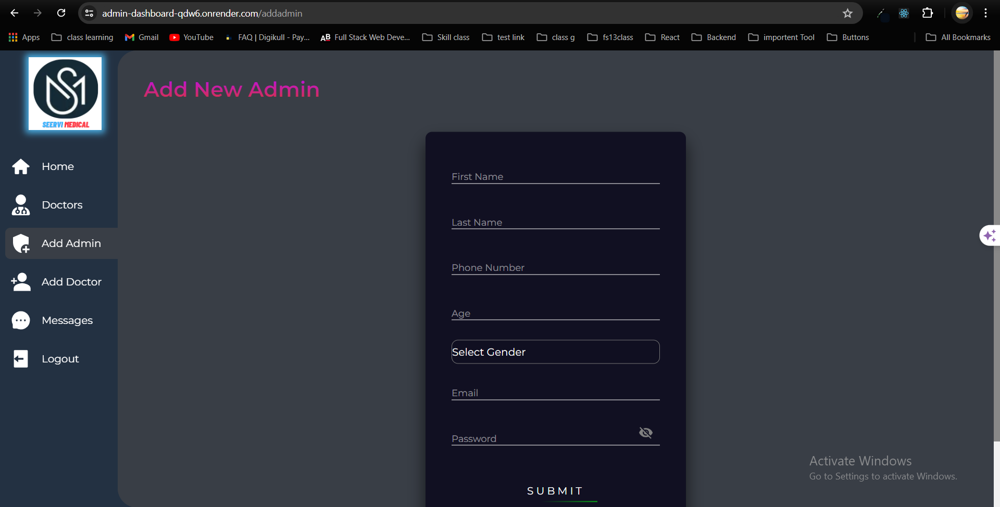

# Hospital Management Application

## Frontend Application Link👇

## [Seervi Medical Institute](https://mern-hospital-management-1.onrender.com/)


## Admin Dashboard  Link👇

## [Admin Dashboard](https://admin-dashboard-qdw6.onrender.com/)





## Overview

The Hospital Management System is a comprehensive web application aimed at facilitating the management of hospital operations. It offers features for booking appointments, sending messages, and providing information about the hospital. The system ensures a seamless experience for patients to interact with the hospital's services online.

## Tech Stack

- **Frontend:** React, React Router
- **Backend:** Node.js, Express (APIs)
- **HTTP Client:** Axios
- **Styling:** CSS
- **Notifications:** React Toastify
- **Database:** MongoDB

## API Used

1. **Get Patient User**

   - **Endpoint:** `https://mern-hospital-management.onrender.com/api/v1/user/patient`
   - **Method:** GET
   - **Description:** Fetches the currently authenticated patient user.
2. **Get All Doctors**

   - **Endpoint:** `https://mern-hospital-management.onrender.com/api/v1/user/doctors`
   - **Method:** GET
   - **Description:** Fetches all doctors available in the system.
3. **Send Message**

   - **Endpoint:** `https://mern-hospital-management.onrender.com/api/v1/message/send`
   - **Method:** POST
   - **Description:** Sends a message to the hospital administration.
4. **Book Appointment**

   - **Endpoint:** `https://mern-hospital-management.onrender.com/api/v1/appointment/book`
   - **Method:** POST
   - **Description:** Books an appointment with a specified doctor.

## Extra Features

- **Authentication:** User authentication to secure access to patient functionalities.
- **Form Handling:** Dynamic forms for sending messages and booking appointments.
- **Real-Time Notifications:** Utilizes React Toastify to provide immediate feedback to users on their actions.

## UI/Responsiveness

- **Navigation Bar:** Provides easy access to different sections of the application.
- **Footer:** Includes additional information and links.
- **Responsive Design:** Ensures usability on various devices and screen sizes.

## Optimized Design

- **Efficient State Management:** Utilizes React context and hooks to manage application state.
- **Conditional Rendering:** Renders components based on the authentication state and data availability.
- **Dynamic Doctor Filtering:** Filters doctors based on selected department for booking appointments.

## Future Enhancements

1. **Enhanced Error Handling:** Implement better error handling and user feedback for API failures.
2. **Role-Based Access Control:** Differentiate access levels for various types of users (e.g., admin, doctor).
3. **Analytics Dashboard:** Provide detailed analytics and reports on hospital operations.
4. **Appointment Notifications:** Send notifications to patients and doctors for appointment updates.
5. **Integration with EHR Systems:** Integrate with Electronic Health Record systems for seamless data exchange.

## Setup and Installation

1. Clone the repository:
   ```sh
   git clone https://github.com/yourusername/hospital-management-system.git
   ```
2. Navigate to the project directory:
   ```sh
   cd hospital-management-system
   ```
3. Install the dependencies:
   ```sh
   npm install
   ```
4. Run the application:
   ```sh
   npm start
   ```

### Base URL

`https://mern-hospital-management.onrender.com`

#### End Point -> User

`POST` `/signup`

`POST` `/login`

`POST` `/admin/addnew`

`GET` `/doctors`

`GET` `/admin`

`GET` `/patient`

`GET` `/admin/logout`

`GET` `/patient/logout`

`POST` `/doctor/addnew`

### End Point 👉 Message

`POST` `/send`

`GET` `/getall`

### End Point 👉 Appointment

`POST` `/book`

`GET` `/get-all-appointments`

`PUT` `/update/:id`

`DELETE` `/delete/:id`

## Conclusion

The Hospital Management System is designed to enhance the efficiency of hospital administration. With features for managing appointments, sending messages, and providing information about the hospital, it offers a comprehensive solution for hospital management needs. Future enhancements will further improve the functionality and usability of the system.
